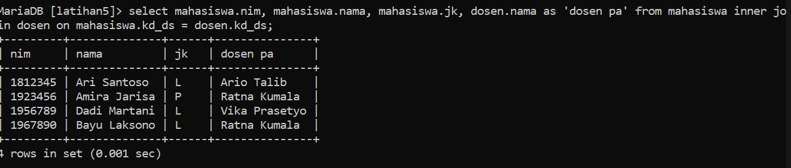
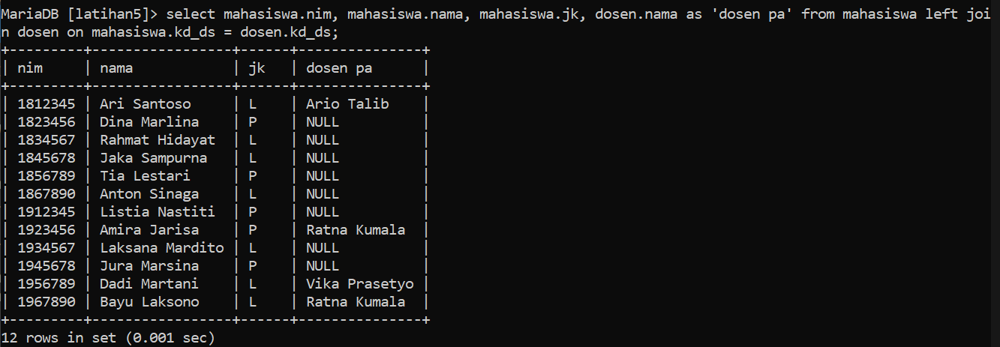
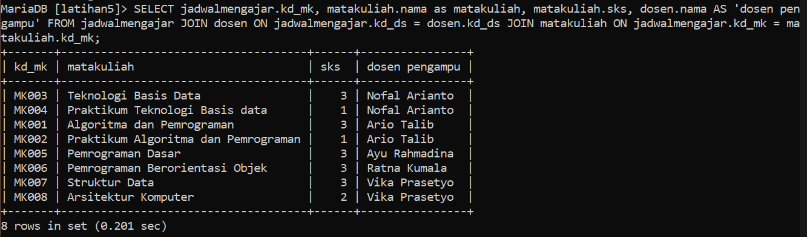
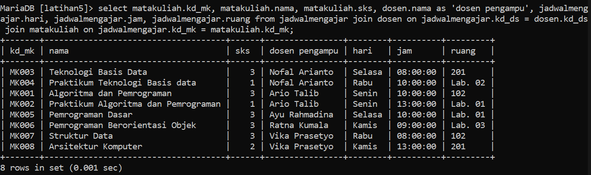
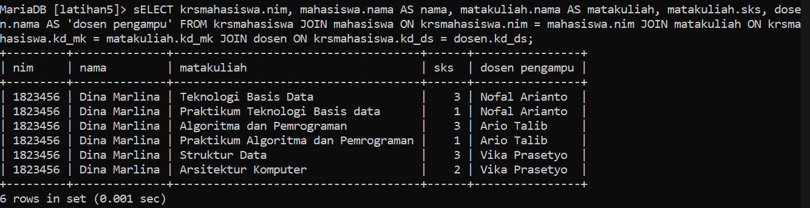

## Lengkapi data tabel
1. Tabel mahasiswa

## Latihan, lakukan join tabel
1. mahasiswa dan dosen

`select mahasiswa.nim, mahasiswa.nama, mahasiswa.jk, dosen.nama as 'dosen pa' from mahasiswa inner join dosen on mahasiswa.kd_ds = dosen.kd_ds;`

2. matakuliah dan dosen

`select mahasiswa.nim, mahasiswa.nama, mahasiswa.jk, dosen.nama as 'dosen pa' from mahasiswa left join dosen on mahasiswa.kd_ds = dosen.kd_ds;`

3. jadwalmengajar, dosen, matakuliah

`SELECT jadwalmengajar.kd_mk, matakuliah.nama as matakuliah, matakuliah.sks, dosen.nama AS 'dosen pengampu' FROM jadwalmengajar JOIN dosen ON jadwalmengajar.kd_ds = dosen.kd_ds JOIN matakuliah ON jadwalmengajar.kd_mk = matakuliah.kd_mk;`

`select matakuliah.kd_mk, matakuliah.nama, matakuliah.sks, dosen.nama as 'dosen pengampu', jadwalmengajar.hari, jadwalmengajar.jam, jadwalmengajar.ruang from jadwalmengajar join dosen on jadwalmengajar.kd_ds = dosen.kd_ds join matakuliah on jadwalmengajar.kd_mk = matakuliah.kd_mk;`

4. krsmahasiswa, mahasiswa, matakuliah, dan dosen

`SELECT krsmahasiswa.nim, mahasiswa.nama AS nama, matakuliah.nama AS matakuliah, matakuliah.sks, dosen.nama AS 'dosen pengampu' FROM krsmahasiswa JOIN mahasiswa ON krsmahasiswa.nim = mahasiswa.nim JOIN matakuliah ON krsmahasiswa.kd_mk = matakuliah.kd_mk JOIN dosen ON krsmahasiswa.kd_ds = dosen.kd_ds;`

